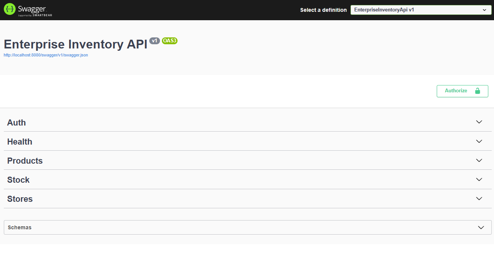
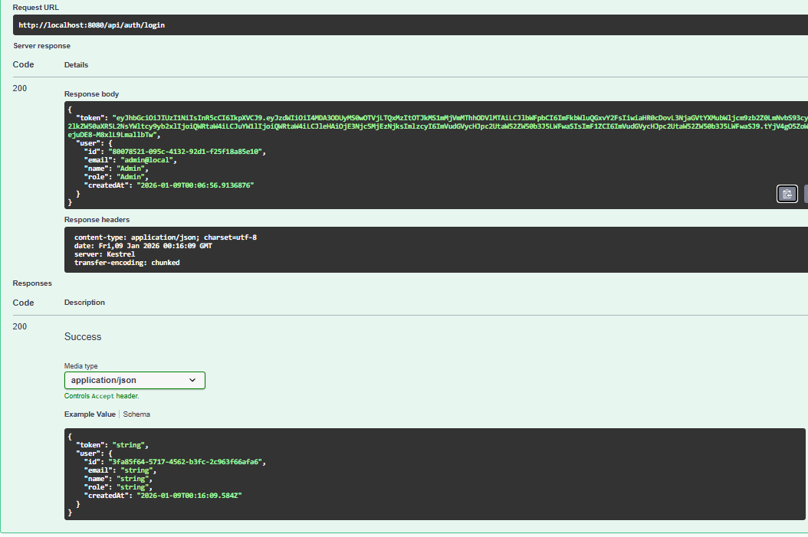
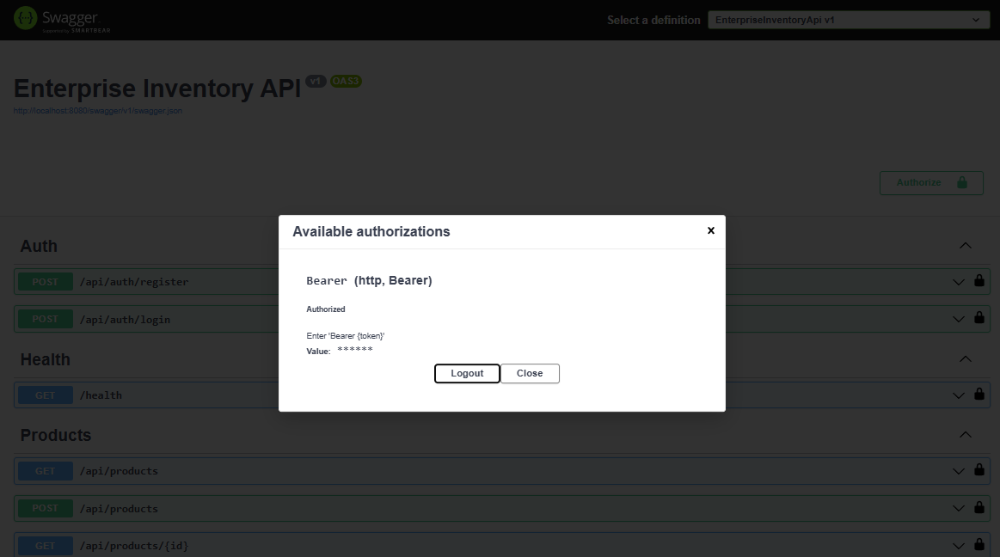
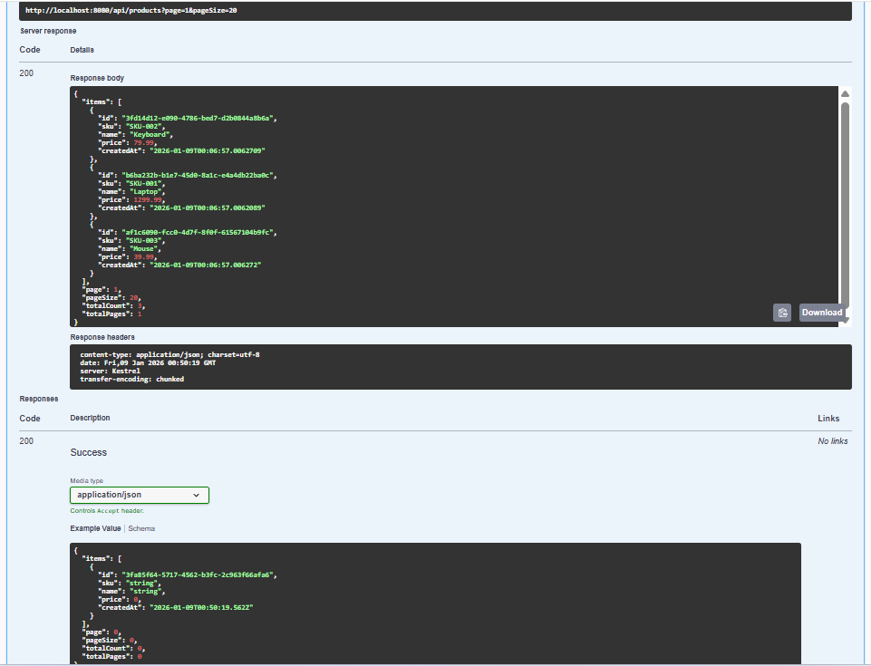
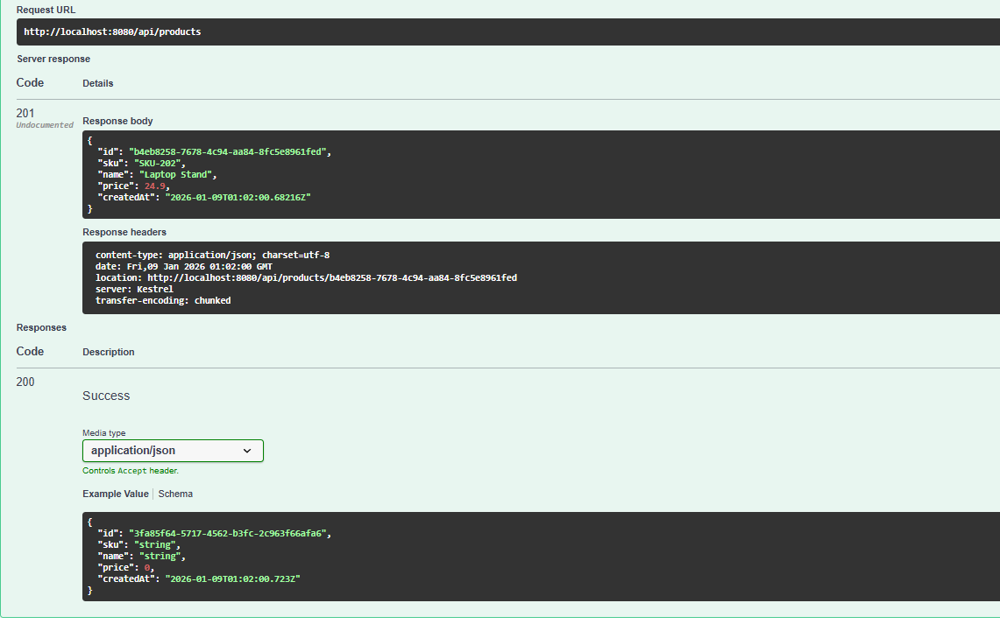
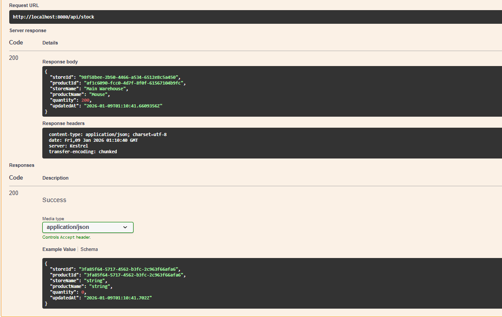

# Enterprise Inventory API

Enterprise Inventory API is a production-ready backend service designed for managing products, stores, and stock across multiple locations.
It demonstrates clean architecture, secure authentication, and enterprise-grade backend practices.

This project is built as a portfolio-grade system, suitable for real-world business use and technical evaluation.

---

## Features

- JWT-based authentication and authorization
- Role-based access control (Admin / User)
- Product management (CRUD)
- Store management (CRUD)
- Stock tracking per store and product
- Pagination and clean REST endpoints
- Centralized error handling
- Swagger / OpenAPI documentation
- Dockerized setup (API and Database)

---

## Tech Stack

- ASP.NET Core Web API (.NET 8)
- Entity Framework Core
- SQL Server (Docker)
- JWT Authentication
- Swagger / OpenAPI
- Docker and Docker Compose

---

## Getting Started

### Run with Docker (Recommended)

```bash
cp .env.example .env
docker compose up --build
```

API: http://localhost:8080  
Swagger UI: http://localhost:8080/swagger

---

### Environment Variables (.env.example)

```env
# SQL Server
SA_PASSWORD=YourStrong!Passw0rd2026

# JWT
Jwt__Key=ChangeMe_ThisIsA_32+Char_SuperSecretKey_2026!!
Jwt__Issuer=enterprise-inventory-api
Jwt__Audience=enterprise-inventory-api
Jwt__ExpiresMinutes=60
```

The `.env` file must not be committed to version control.

---

### Run Locally (API local, DB in Docker)

```bash
docker compose up db
```

Set environment variables:

```bash
ConnectionStrings__DefaultConnection=Server=localhost,1433;Database=EnterpriseInventoryDb;User Id=sa;Password=YourStrong!Passw0rd2026;TrustServerCertificate=True;Encrypt=False
Jwt__Key=ChangeMe_ThisIsA_32+Char_SuperSecretKey_2026!!
Jwt__Issuer=enterprise-inventory-api
Jwt__Audience=enterprise-inventory-api
Jwt__ExpiresMinutes=60
```

Run the API:

```bash
cd src/EnterpriseInventoryApi
dotnet run
```

---

## Database Migrations

```bash
cd src/EnterpriseInventoryApi
dotnet ef database update
```

---

## Authentication

- JWT Bearer authentication
- Tokens generated on login
- Secured endpoints require Authorization header with Bearer token

Default seeded admin user:

Email: admin@local  
Password: Admin123!

---

## API Walkthrough (Swagger)

### Swagger Overview



### Authentication - Login

Successful login returning a JWT token.



### JWT Authorization

JWT token applied via Swagger Authorize button.



### Products - List

Paginated list of products.



### Products - Create

Admin creates a new product.



### Stock - Update and View

Stock quantity per store and product.



---

## API Endpoints

Auth  
POST /api/auth/register  
POST /api/auth/login  

Products  
GET /api/products  
GET /api/products/{id}  
POST /api/products  
PUT /api/products/{id}  
DELETE /api/products/{id}  

Stores  
GET /api/stores  
GET /api/stores/{id}  
POST /api/stores  
PUT /api/stores/{id}  
DELETE /api/stores/{id}  

Stock  
GET /api/stock  
PUT /api/stock  

Health  
GET /health  

---

## Architecture Notes

- Clean separation of Controllers, Application, and Infrastructure layers
- Centralized exception handling middleware
- DTO-based request and response models
- Configuration via environment variables
- Designed for extensibility and scalability

---

## Purpose

This project was built to demonstrate professional backend development practices, real-world API design, secure authentication flows, and maintainable code.

It is intended for technical review, interviews, and production-style evaluation.

---

## License

MIT License
